# BonPOS — ERD / RDBMS

Sumber kebenaran skema: [`backend/prisma/schema.prisma`](../backend/prisma/schema.prisma).  
Database: **PostgreSQL 16**, multi-tenant shared-schema (`tenant_id` + **RLS**).

## Prinsip data

| Aturan | Implementasi |
|--------|----------------|
| Multi-tenancy | Hampir semua tabel punya `tenant_id` → `tenants`; isolasi via RLS |
| Uang | Integer **sen** (`*InCents`) — tidak pakai `float` |
| Pajak / promo % | Basis points (`*Bps`, e.g. 1100 = 11%) |
| Soft isolation toko | `store_id` pada stok, harga, shift, KDS, meja, PO, dll. |
| On-prem sync | `edge_sync_outbox` + `edge_sync_cursors` |

**56 tabel** · diagram Mermaid per domain (syntax GitHub-compatible: kunci `PK, FK` dengan koma).

---

## 1. Tenancy & outlet

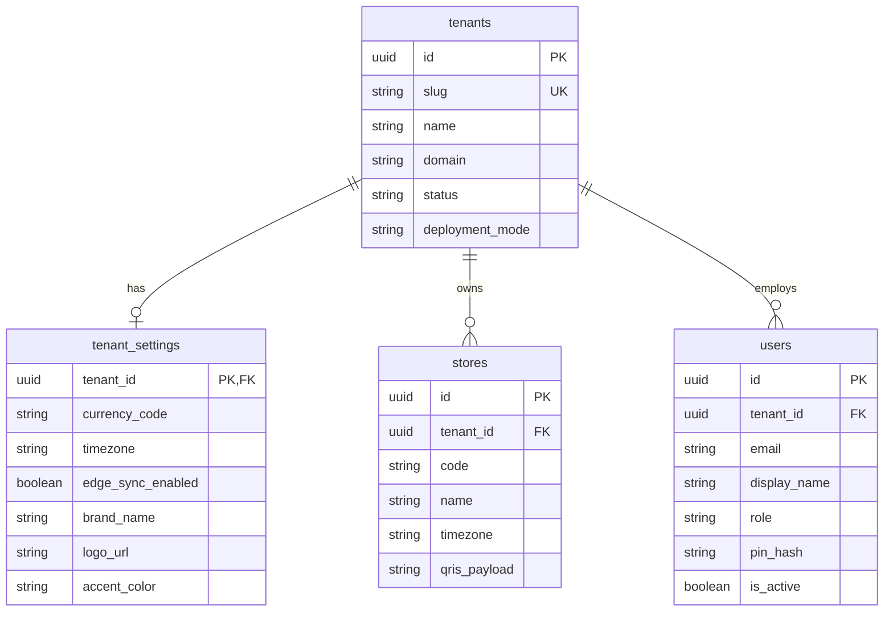

---

## 2. Katalog & stok per toko

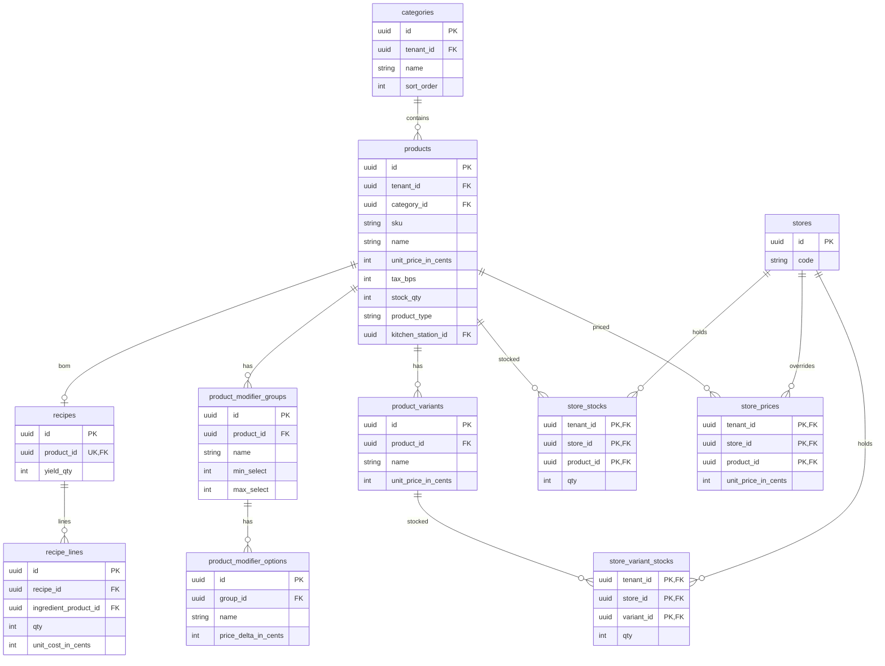

---

## 3. Keranjang, penjualan & pembayaran

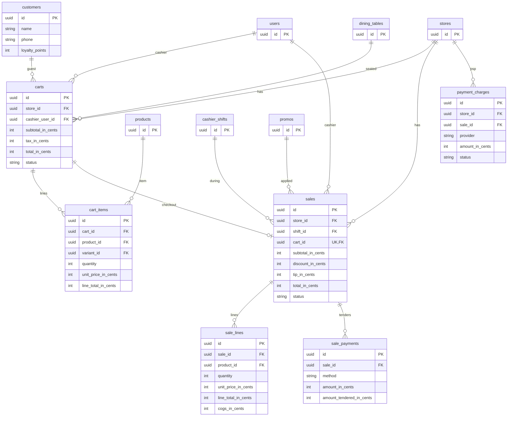

---

## 4. Shift kasir & audit

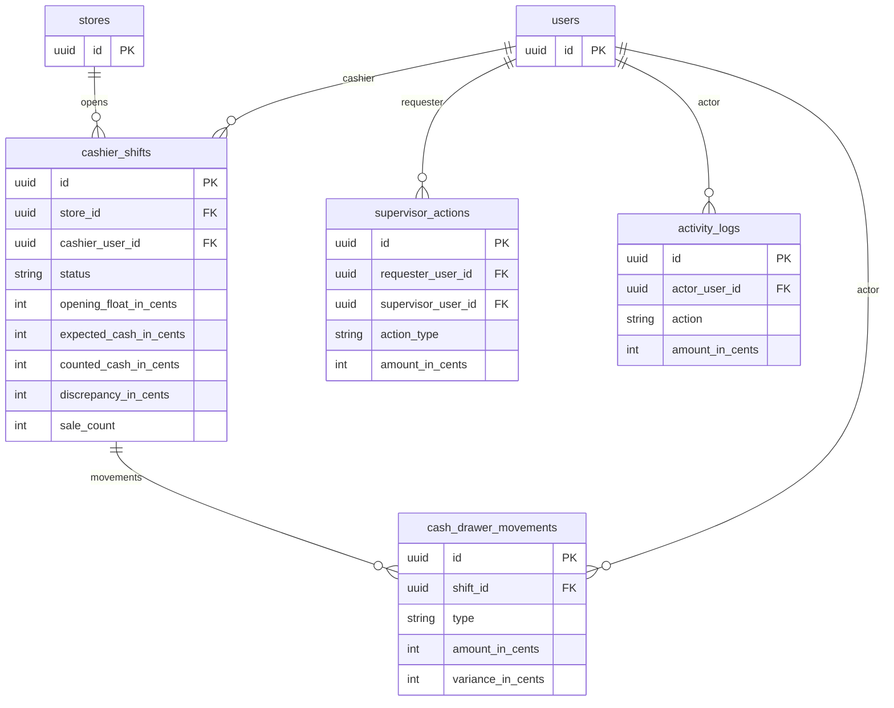

---

## 5. Dapur (KDS)

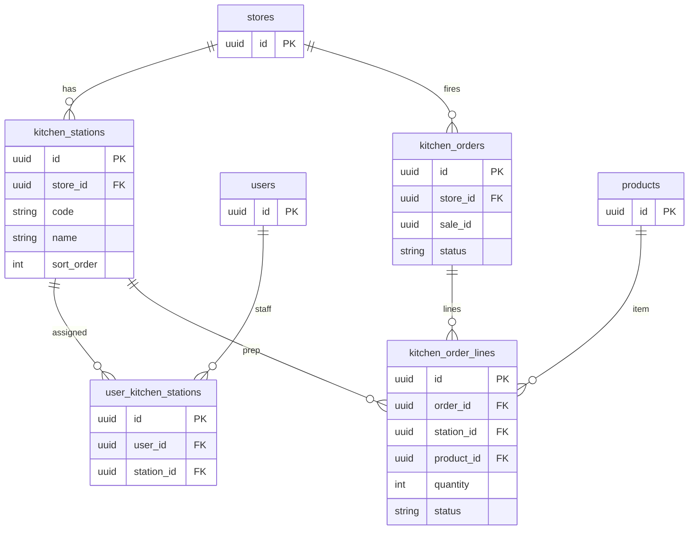

---

## 6. Inventori, pembelian & opname

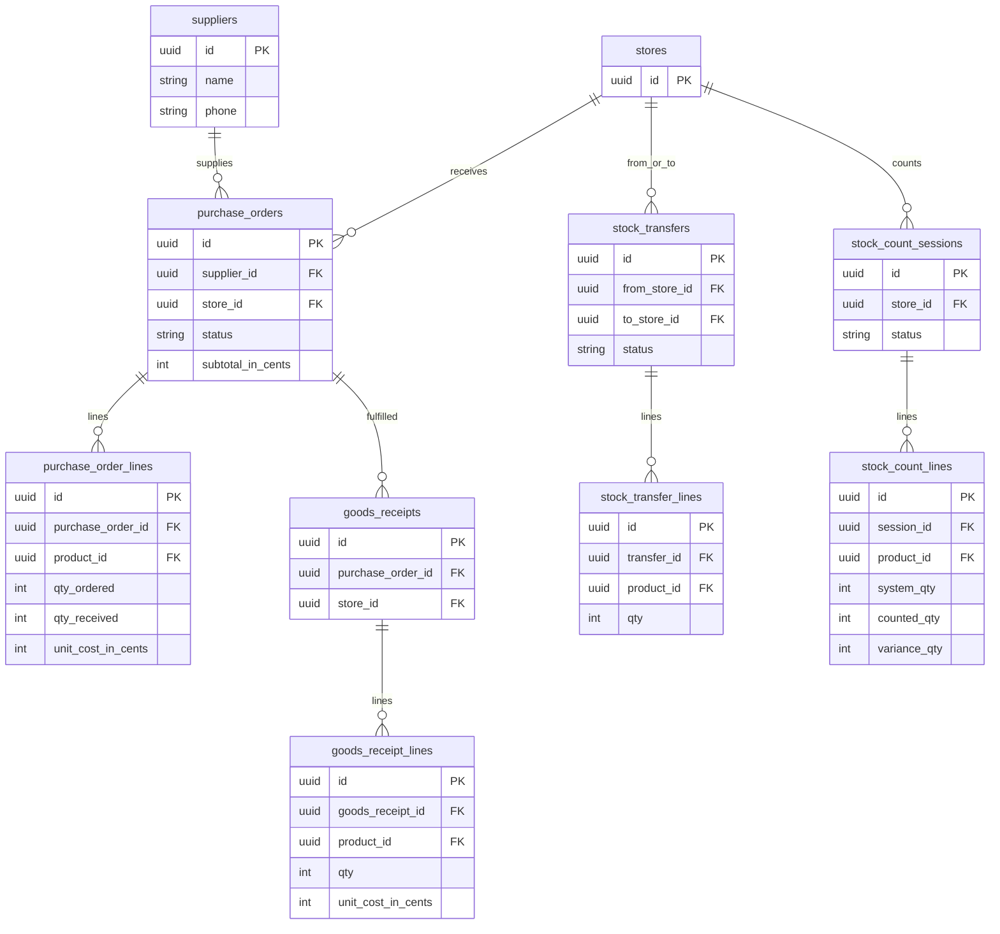

---

## 7. Meja & promo

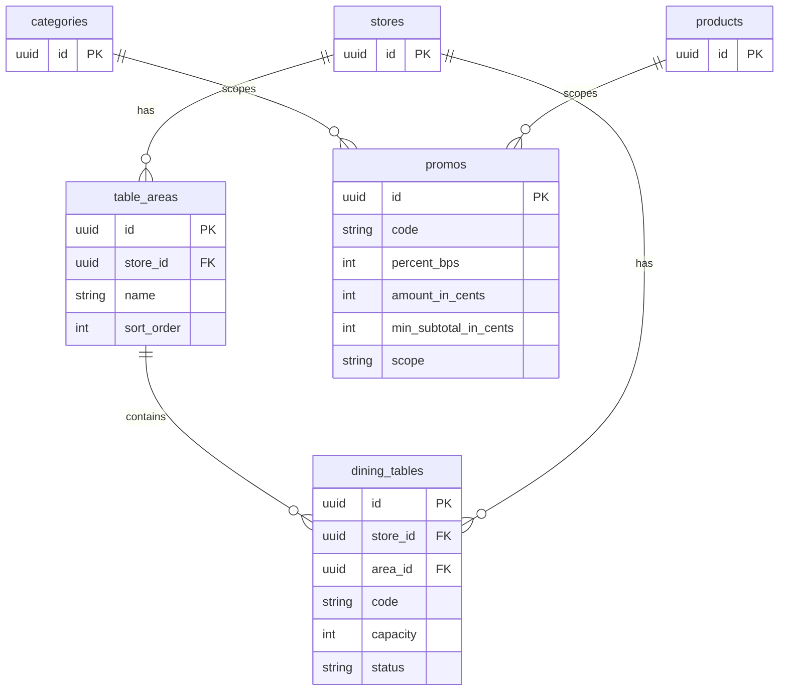

---

## 8. HRIS

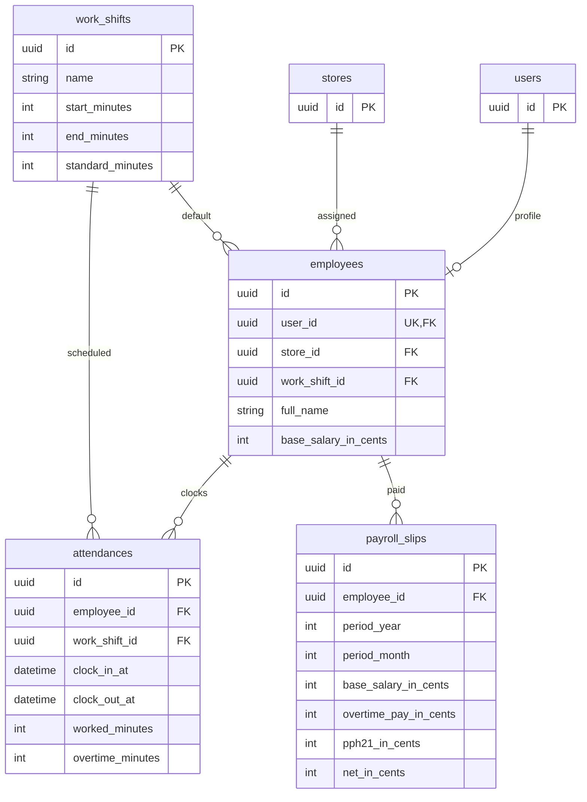

---

## 9. Analitik harian

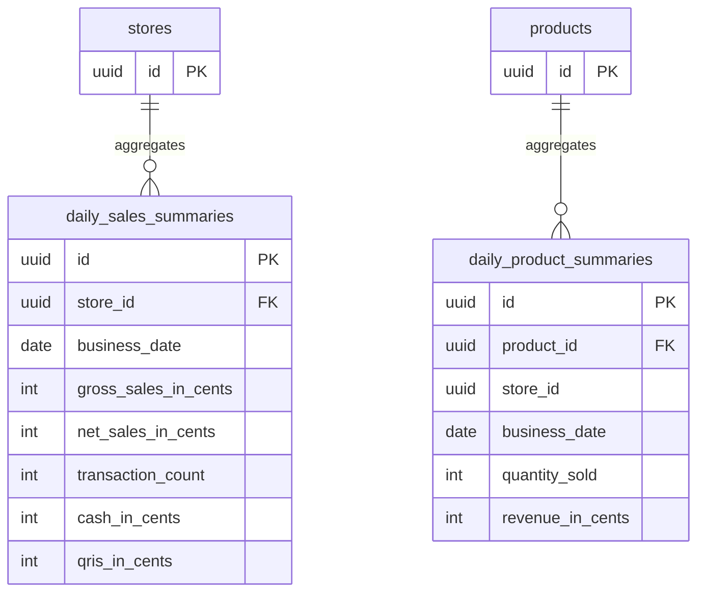

---

## 10. Finance GL & integrasi eksternal

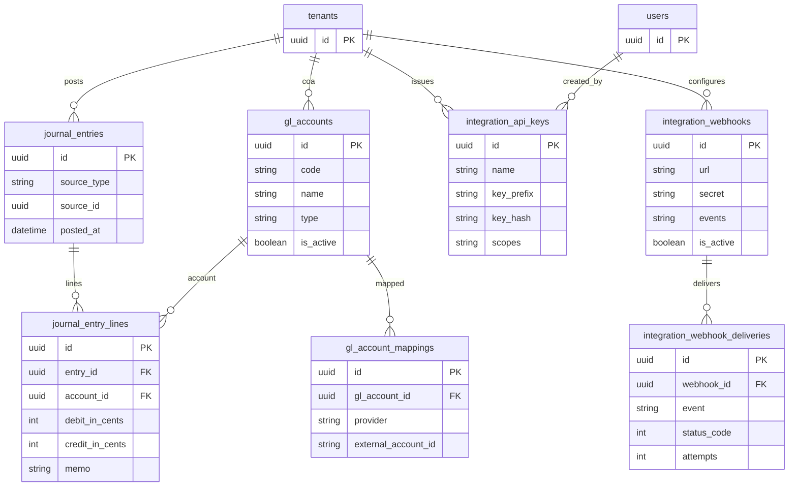

---

## 11. Edge sync (on-prem ↔ hub)

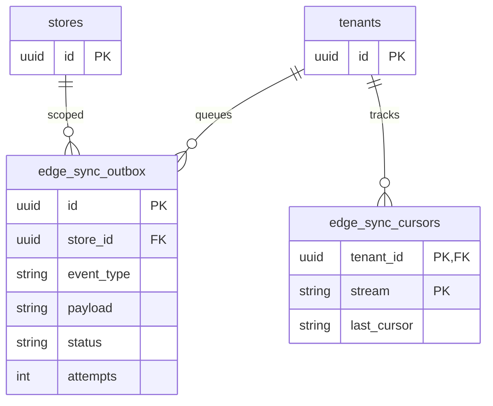

---

## Inventaris tabel (56)

| Domain | Tabel |
|--------|--------|
| Tenancy | `tenants`, `tenant_settings`, `stores`, `users` |
| Shift / audit | `cashier_shifts`, `cash_drawer_movements`, `supervisor_actions`, `activity_logs` |
| Katalog | `categories`, `products`, `product_variants`, `product_modifier_groups`, `product_modifier_options`, `store_stocks`, `store_prices`, `store_variant_stocks`, `recipes`, `recipe_lines`, `customers` |
| POS | `carts`, `cart_items`, `sales`, `sale_lines`, `sale_payments`, `payment_charges`, `promos` |
| KDS | `kitchen_stations`, `user_kitchen_stations`, `kitchen_orders`, `kitchen_order_lines` |
| Inventori | `suppliers`, `purchase_orders`, `purchase_order_lines`, `goods_receipts`, `goods_receipt_lines`, `stock_transfers`, `stock_transfer_lines`, `stock_count_sessions`, `stock_count_lines` |
| Outlet | `table_areas`, `dining_tables` |
| HRIS | `employees`, `work_shifts`, `attendances`, `payroll_slips` |
| Analitik | `daily_sales_summaries`, `daily_product_summaries` |
| Finance | `gl_accounts`, `journal_entries`, `journal_entry_lines`, `integration_api_keys`, `gl_account_mappings`, `integration_webhooks`, `integration_webhook_deliveries` |
| Edge | `edge_sync_outbox`, `edge_sync_cursors` |

---

## Catatan relasi longgar

Kolom UUID tanpa `@relation` Prisma:

- `supervisor_actions.sale_id`
- `kitchen_orders.sale_id`
- `attendances.cashier_shift_id`
- `daily_product_summaries.store_id`

---

## Regenerasi

```bash
cd backend
npx prisma migrate dev --name <deskripsi>
npx prisma generate
```

Dokumentasi ini diselaraskan manual dengan `schema.prisma`.
